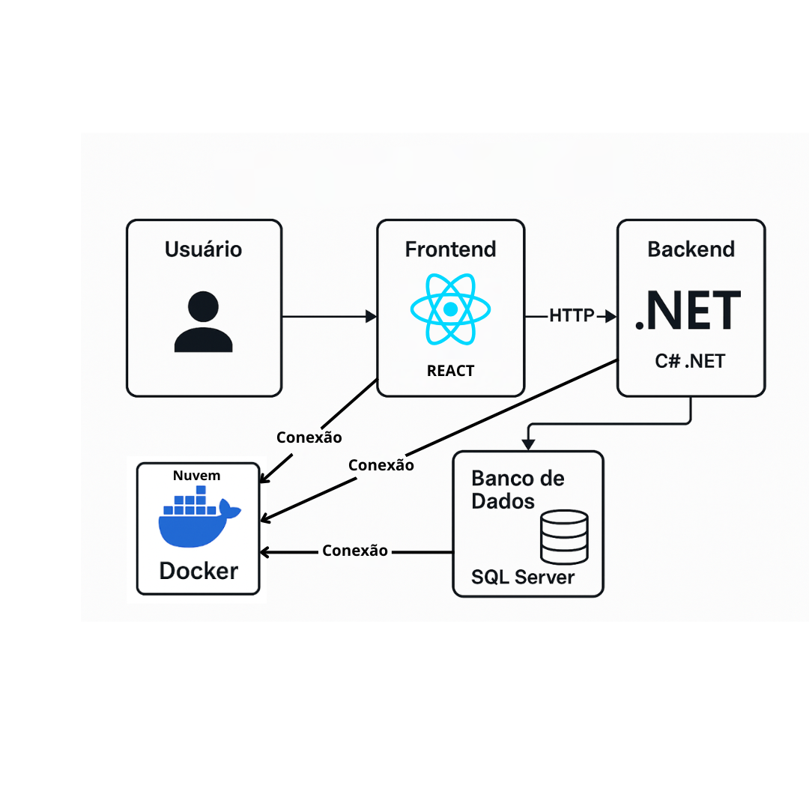

## 4. Projeto da Solução

Pré-requisitos: <a href="03-Modelagem do Processo de Negocio.md"> Modelagem do Processo de Negocio</a>

## 4.1. Arquitetura da solução

O sistema Easy Host foi pensado para ser uma solução prática, organizada e fácil de usar, voltada especialmente para pequenos hotéis e pousadas. Para isso, adotamos uma arquitetura em camadas, separando o que é interface, o que é processamento e o que é armazenamento de dados. Isso torna o sistema mais organizado e fácil de manter.

Abaixo, apresentamos o diagrama da estrutura do sistema:

Descrição dos Módulos e Tecnologias
Usuário: O sistema pode ser acessado diretamente pelo navegador, tanto no computador quanto no celular, permitindo maior praticidade para os usuários.

Frontend (Angular): Escolhemos o Angular para construir a parte visual do sistema, por ser uma tecnologia moderna que permite criar páginas rápidas e responsivas. O frontend se comunica com o backend usando requisições HTTP.

Backend (C# .NET): Para cuidar das regras do sistema e do funcionamento das funções, usamos C# com .NET, uma tecnologia robusta e eficiente, muito utilizada no mercado.

Banco de Dados (SQL Server): Todas as informações, como reservas e dados dos hóspedes, serão armazenadas em um banco de dados SQL Server, facilitando o acesso rápido e seguro às informações.

Hospedagem (a definir): Pretendemos usar Docker para empacotar e hospedar o sistema, o que nos permite mais flexibilidade para instalar tanto em servidores locais quanto em nuvens, dependendo da necessidade do cliente.

Justificativa da Arquitetura
Organizamos o sistema dessa forma para facilitar futuras melhorias, como adicionar novas funcionalidades sem precisar refazer o que já foi construído. Separar a interface, o processamento e o banco de dados também facilita o trabalho em equipe e deixa o sistema mais estável e confiável.

 

### 4.2. Protótipos de telas

### 
Login

### 
HOME (FUNCIONÁRIO)

.png)
### 
HOME (ADMIN)

.png)
### 
MENU DE QUARTOS

### 
PÁGINA QUARTOS (DISPONÍVEL)

.png)
### 
PÁGINA QUARTOS (OCUPADO)

.png)
### 
CRUD (FUNCIONÁRIO)

.png)
### 
CRUD (QUARTOS)

.png)
### 
CRUD (SERVIÇOS)

.png)
### 
SERVIÇOS INTERNOS

### 
RELATÓRIO GERAL

## Diagrama de Classes

## Modelo ER

### 4.3. Modelo de dados

#### 4.3.1 Modelo ER

#### 4.3.2 Esquema Relacional

---

#### 4.3.3 Modelo Físico

Insira aqui o script de criação das tabelas do banco de dados.

Veja um exemplo:

<code>

 -- Criação da tabela Médico
CREATE TABLE Medico (
    MedCodigo INTEGER PRIMARY KEY,
    MedNome VARCHAR(100)
);

-- Criação da tabela Paciente
CREATE TABLE Paciente (
    PacCodigo INTEGER PRIMARY KEY,
    PacNome VARCHAR(100)
);

-- Criação da tabela Consulta
CREATE TABLE Consulta (
    ConCodigo INTEGER PRIMARY KEY,
    MedCodigo INTEGER,
    PacCodigo INTEGER,
    Data DATE,
    FOREIGN KEY (MedCodigo) REFERENCES Medico(MedCodigo),
    FOREIGN KEY (PacCodigo) REFERENCES Paciente(PacCodigo)
);

-- Criação da tabela Medicamento
CREATE TABLE Medicamento (
    MdcCodigo INTEGER PRIMARY KEY,
    MdcNome VARCHAR(100)
);

-- Criação da tabela Prescricao
CREATE TABLE Prescricao (
    ConCodigo INTEGER,
    MdcCodigo INTEGER,
    Posologia VARCHAR(200),
    PRIMARY KEY (ConCodigo, MdcCodigo),
    FOREIGN KEY (ConCodigo) REFERENCES Consulta(ConCodigo),
    FOREIGN KEY (MdcCodigo) REFERENCES Medicamento(MdcCodigo)
);

</code>

Este script deverá ser incluído em um arquivo .sql na pasta src\bd.

### 4.4. Tecnologias

_Descreva qual(is) tecnologias você vai usar para resolver o seu problema, ou seja, implementar a sua solução. Liste todas as tecnologias envolvidas, linguagens a serem utilizadas, serviços web, frameworks, bibliotecas, IDEs de desenvolvimento, e ferramentas._

Apresente também uma figura explicando como as tecnologias estão relacionadas ou como uma interação do usuário com o sistema vai ser conduzida, por onde ela passa até retornar uma resposta ao usuário.

| **Dimensão**   | **Tecnologia**  |
| ---            | ---             |
| SGBD           | MySQL           |
| Front end      | HTML+CSS+JS     |
| Back end       | Java SpringBoot |
| Deploy         | Github Pages    |

